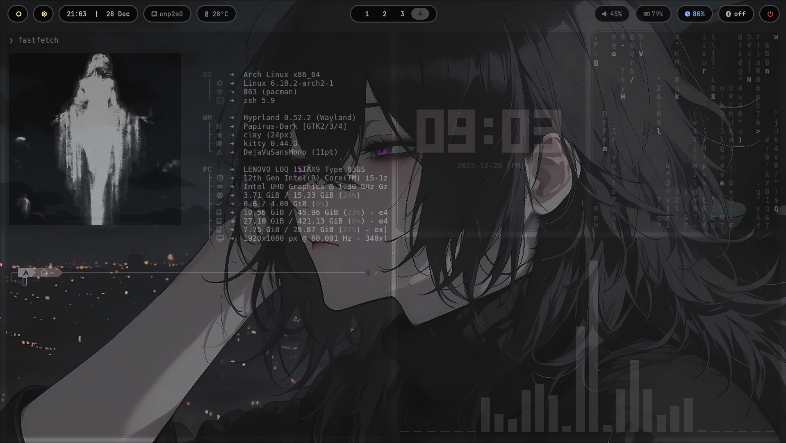
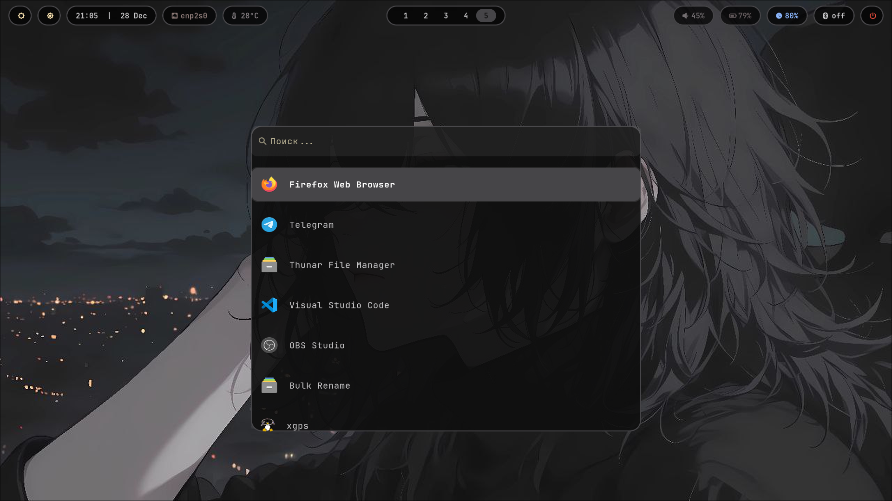

# ❄️ teigu-dotfiles | Arch + Hyprland

Индивидуальная конфигурация окружения (rice), ориентированная на минимализм и системную эффективность. Репозиторий переведен из разряда "личный конфиг" в документированный проект.

---

## 📸 Screenshots
> Скриншоты системы находятся в директории /screenshots.

---

## 🛠️ Стек (Technical Stack)
* OS: Arch Linux 
* WM: Hyprland (Wayland)
* Terminal: Kitty
* Shell: Zsh + Oh-My-Zsh
* Status Bar: Waybar
* Launcher: Wofi / Rofi
* File Manager: Thunar / Yazi

---

## 📦 Зависимости и Пакеты (Dependencies)
Для полной репликации окружения необходимы следующие ключевые пакеты:

| Категория | Пакеты |
| :--- | :--- |
| Core | hyprland, waybar, kitty, swww, dunst |
| Utils | wofi, grim, slurp, wl-clipboard, network-manager-applet |
| Fonts | JetBrainsMono Nerd Font, Noto Sans |

---

## ⚙️ Установка (Installation) — [WIP]
На данный момент поддерживается только ручная установка. Скрипт автоматизации в разработке.

1. Клонируйте репозиторий:
   git clone https://github.com/Teiguuu/dotfiles.git
   
   cd dotfiles
   
3. Создайте симлинки (рекомендуется GNU Stow):
   stow hypr
   (Или скопируйте вручную: cp -r ./hypr ~/.config/)

---

## 📜 Скрипты (Scripts)
Все системные скрипты задокументированы и находятся в папке scripts/ (или внутри конфигов).

* wallpaper.sh: Автоматическая смена обоев с использованием swww. 
* waybar-reload.sh: Моментальный перезапуск панели при изменении конфига (удобно при дебаге).
* screenshot.sh: Создание снимков области экрана с сохранением в ~/Pictures/Screenshots.

> Note: Все скрипты оформляются с учетом стандартов Bash и проходят проверку shellcheck.

---

## 📂 Структура репозитория

├── hypr/               - Конфиги Hyprland

├── waybar/             - Стили и настройки статус-бара

├── kitty/              - Конфигурация терминала

├── scripts/            - Вспомогательные bash-скрипты

├── screenshots/        - Примеры внешнего вида

└── pkglist.txt         - Список системных зависимостей

---

## 🚀 План развития (Roadmap)
- [ ] Написать идемпотентный install.sh.
- [ ] Настроить полноценное управление через GNU Stow.
- [ ] Добавить поддержку тем (Dark/Light) через pywal.
- [ ] Интеграция с power-profiles-daemon для оптимизации батареи.

---
